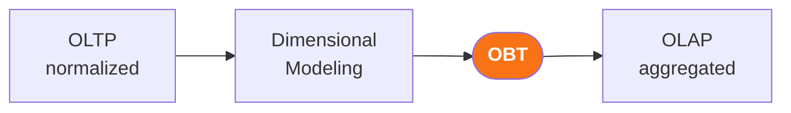

# One table, many entities — the root of the confusion

OBTs in 1NF often mix **multiple entities** in every row.

- Horizontal redundancy is acceptable
- Denormalization can **hide** data
- And silently **generate duplicates**

*The table isn't wrong. It's opaque.*

<!--
Let's start with the fundamentals. A table in First Normal Form — 1NF — simply means each column holds one atomic value and there are no duplicate rows. That's it. That's the only constraint.
So a 1NF table can contain your customers, their orders, their products, and their purchase history — all in one row, repeated for every combination.
The table isn't technically wrong. It satisfies 1NF.
But it's opaque — you can't see the entities inside it without looking carefully.
And when you denormalize, it becomes easy to hide rows or create unintended duplicates without any visible error.
That's what we're going to learn to see.
-->

---

# Tables promise simplicity — and then complexity leaks through

Designed to hide structure, they transfer it instead:

- **Indices** to design and maintain
- **Query patterns** to optimize
- **Normalization** decisions that come back later

> Like a pandas DataFrame that silently hits memory limits — the execution model always leaks through.

<!-- TODO: Visual - MEDIUM PRIORITY
Type: Simple diagram — abstraction layer with arrows "leaking" through it
Why: Makes the "leaky abstraction" metaphor concrete before the technical content
Element count: 1 diagram + 1 quote = 2 elements ✓
-->

<!--
Joel Spolsky coined the phrase "leaky abstraction" — every abstraction, no matter how well designed, eventually leaks details of the underlying implementation.
Tables are a leaky abstraction.
They're supposed to give you a clean, simple interface to your data. Instead, they transfer the complexity to you in a different form.
You need indices to make them fast. You need to understand query patterns to use them correctly. And when you need to change them, all the normalization decisions you ignored come back to haunt you.
If you've written a pandas groupby on a wide DataFrame and watched your machine start sweating — you've felt this. The table looked flat and simple. The execution model was leaking through.
-->

---

# OBTs are the destination — not the starting point

- **OLTP**: write-optimized, normalized, 1:1 with objects
- **OLAP**: read-optimized, aggregated, denormalized
- OBT = the *outcome* of the journey

<!--
Here's a mental model shift that changes how you approach OBTs: they don't come from nowhere.
They sit at the end of a data journey.
On the left, your OLTP systems — transactional databases, write-optimized, highly normalized, almost one-to-one with the objects in your application.
Then dimensional modeling happens — Star schema, Snowflake, Data Vault, Anchor.
And then, often, that model gets denormalized into an OBT for analytics consumption.
This means that if you have a messy OBT, you can often trace it back to a dimensional model.
And if you understand the model, you can read the OBT.
That's what the dissection framework gives you — a way to reverse-engineer what's hidden inside.
-->
