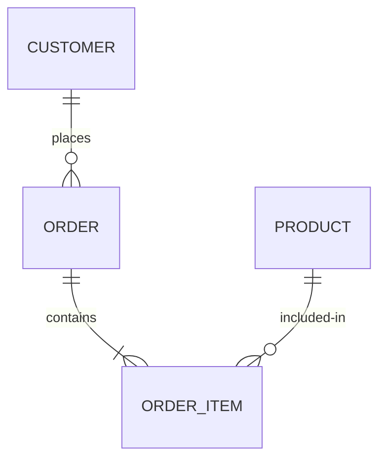
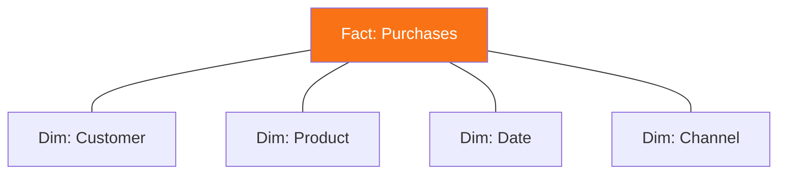
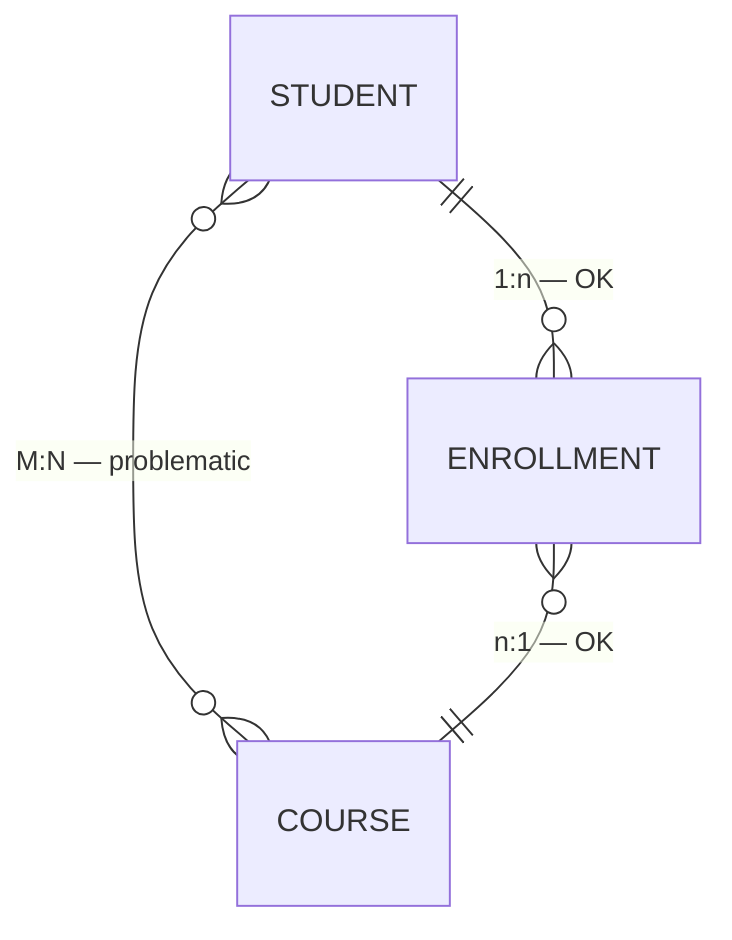

# Now what do you do with it?

---
layout: center
---

# The path forward

1. **Start** with ERD datasets, time-series, and data marts as inputs
2. **Re-normalize** if upstream is denormalized — dissect first
3. **Choose a model**: Star · Snowflake · Data Vault · Anchor
4. **Build** the OBT as the final output, not the first step

<!--
Before we go into the mechanics, let me give you the map.
When you're tasked with building an OBT, you rarely start from nothing.
You have upstream data — ERD-modeled datasets, time-series tables, maybe other data marts.
The dissection framework tells you how to read those inputs.
Then you re-normalize what needs normalizing, choose a modeling approach that fits your use case, and build the OBT as the final output — not the starting point.
Let's walk through the key pieces.
-->

---

# ERDs define the ontology — the taxonomy of your data

- **PK → FK** defines directionality — who owns the relationship
- Time-series: composite key (entity ID + timestamp)

<!--
Entity-Relationship Diagrams are more than technical documentation — they're the ontology of your data.
They define what entities exist, what their attributes are, and how they relate to each other.
The PK to FK relationship defines directionality. Customer places orders. Orders contain items. Products appear in items.
That directionality is critical, because when you JOIN tables, you often lose it.
Time-series tables are a special case: they use a composite key of the entity ID plus a timestamp, because the same entity has many rows over time.
Keep this diagram in your head — you'll need it when we talk about JOINs.
-->

---

# Normalization is surgery — not demolition

- **1NF**: one atomic value per column; no duplicate rows
- **2NF**: every non-key attribute depends on the *entire* PK
- Practical move: replace composite keys with a **surrogate key**

Protection from insertion and deletion anomalies.

*Your dissection map tells you exactly where to cut.*

<!--
Normalization gets a bad reputation in analytics engineering. People think it means painful, risky table rewrites.
It doesn't have to be.
First Normal Form: one value per cell, no duplicate rows. Simple.
Second Normal Form: every attribute must depend on the whole primary key, not just part of it.
The practical implication: if you have a composite key, swap it for a surrogate key. This satisfies 2NF mechanically and makes your table safer.
And here's where the dissection framework pays off: instead of staring at 90 columns wondering where to start, you've already classified everything.
You know which columns belong to which entity. You can make precise, targeted changes.
That's not demolition. That's surgery.
-->

---

# Star schema: facts at the center, dimensions around it

- **Dim tables**: describe actors — Customers, Products
- **Fact tables**: describe events — Purchases, Sales

<!--
The Star schema is the most common modeling pattern for analytics — and for good reason.
It's simple, readable, and maps directly to how business questions are asked.
Dimension tables describe your actors: who your customers are, what your products look like.
Fact tables describe events: what happened, involving which actors, at what time.
When you dissect an OBT, you're often reverse-engineering a Star schema.
The dimension columns you identified map to dimension tables. The fact columns map to a fact table. The keys connect them.
Once you have the Star schema, building the OBT from it is deliberate and controlled — not chaotic denormalization.
-->

---

# M:N relationships need a bridge — not a direct join

Bridge contains: `student_id` (FK) + `course_id` (FK) → composite PK

<!--
Cardinality tells you how entities relate.
One customer places many orders — that's a one-to-many. Straightforward in SQL.
But many students enroll in many courses — that's many-to-many. And RDBMS systems handle M:N poorly when modeled directly.
The solution is a bridge table — sometimes called a junction table or association table.
The bridge contains the foreign keys from both sides, which together form its composite primary key.
This reduces the M:N into two clean 1:n relationships that SQL can handle without surprises.
When you encounter what looks like a many-to-many in an OBT, look for a bridge table upstream. If it's missing, you'll need to create one before you can build a clean model.
-->
