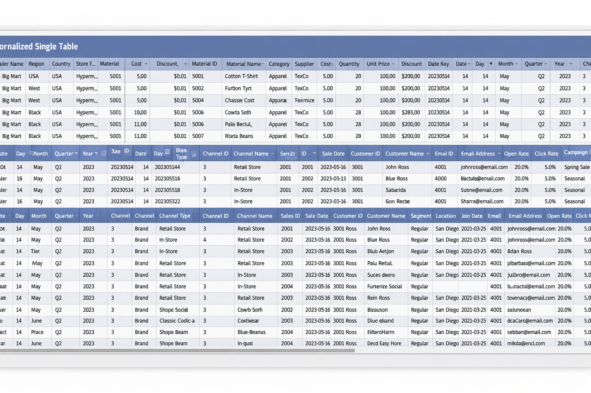

  

# **OBT**: One Big Table

<v-click>

*Raise your hand if you've been here.*

</v-click>

<!--
How many of you have received some version of this request? Go ahead, raise your hand.
[pause for audience]
That's a lot of hands. Good — because everything I'm about to show you applies directly to what you're building right now.
-->

