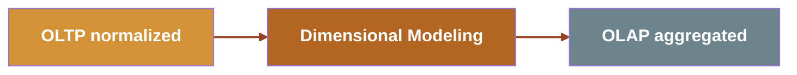

# The DATA JOURNEY

- **OLTP**: write-optimized, normalized, 1:1 with objects
- **Dimensional modeling**: many to chose from `Star`, `Snowflake`, `Data Vault`, `Anchor` modeling
- **OLAP**: read-optimized, aggregated, denormalized

## OBTs are the  *outcome* of the journey
