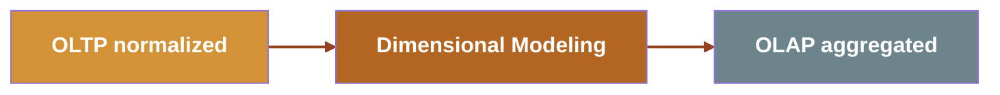

# The DATA JOURNEY

- **OLTP**: write-optimized, normalized, 1:1 with objects
- **Dimensional modeling**: many to chose from `Star`, `Snowflake`, `Data Vault`, `Anchor` modeling
- **OLAP**: read-optimized, aggregated, denormalized

## OBTs are the  *outcome* of the journey

<!--
Here's a mental model shift that changes how you approach OBTs: they don't come from nowhere.
They sit at the end of a data journey.
On the left, your OLTP systems — transactional databases, write-optimized, highly normalized, almost one-to-one with the objects in your application.
Then dimensional modeling happens — Star schema, Snowflake, Data Vault, Anchor.
And then, often, that model gets denormalized into an OBT for analytics consumption.
This means that if you have a messy OBT, you can often trace it back to a dimensional model.
And if you understand the model, you can read the OBT.
That's what the dissection framework gives you — a way to reverse-engineer what's hidden inside.
-->
