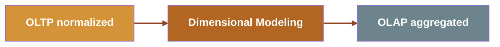

# The DATA JOURNEY

- **OLTP**: write-optimized, normalized, 1:1 with objects
- **Dimensional modeling**: many to chose from `Star`, `Snowflake`, `Data Vault`, `Anchor` modeling
- **OLAP**: read-optimized, aggregated, denormalized

## OBTs are the  *outcome* of the journey

<!--
TIMING: 50 seconds

The OLTP → Dimensional Modeling → OLAP pipeline. Context-setting for everything that follows.

Point to the Mermaid diagram as you speak.

"There's a journey the data has already taken before it lands in your hands."

Arrow 1 — OLTP: "It starts in an online transactional system. Tables optimized for WRITES. Nicely normalized, often one-to-one with domain objects. Think: your orders table, your users table."

Arrow 2 — Dimensional Modeling: "Then it passes through dimensional modeling. You choose a schema — star, snowflake, data vault — and reshape the data."

Arrow 3 — OLAP: "Finally it lands in the realm of online analytical processes. Read-optimized, aggregated, denormalized."

"OBTs are the DESTINATION. They're the end of the journey, not the beginning. Your job is to make sure the journey to get there is sound."

TRANSITION TO NEXT: "Alright. Let's get down to business. Section B: the dissection."
-->
