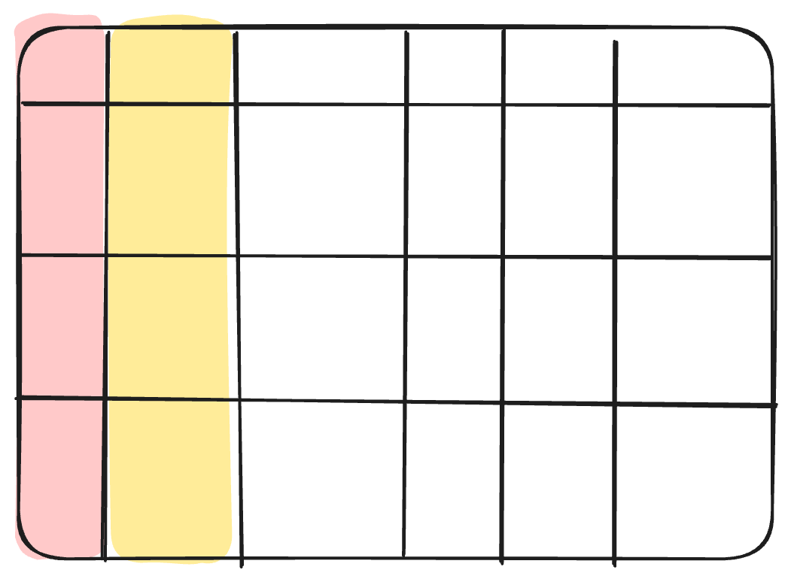

# Dimensions *describe the attributes*

Attributes of an entity: the **who** and the **what**

Subject to change: Slowly Changing Dimensions (SCD)

*Examples: `customer_country`, `product_category`, `phone_number`*

<!-- TODO: Visual - HIGH PRIORITY
Type: Excalidraw (assets/table.excalidraw — dimension columns highlighted green)
-->

<!--
Dimensions describe attributes — the who, what, and where.
Your customer's country. Your product's category. The sales channel.
The key thing about dimensions is that they evolve. Your customer might change their country. Your product might change its category.
This is what Slowly Changing Dimensions — SCDs — are about.
When you see a column in an OBT that describes a property of an entity, that's a dimension.
And here's why this matters for dissection: if you see the same entity attributes repeated across rows with different timestamps, you're looking at an SCD in a denormalized form.
That's a sign you can normalize it back into a proper dimension table.
-->
