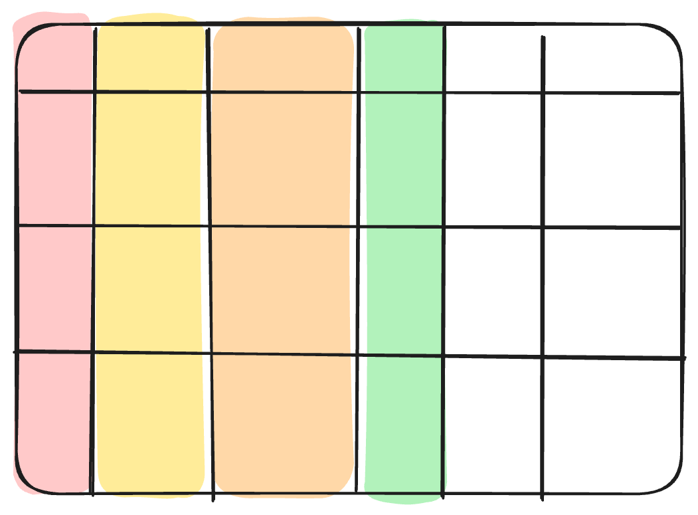

# Measures: *what happened*; Temporal Grains: *when*
 

**Measures/Facts**: point-in-time numeric metrics (`revenue`, `quantity_sold`, `session_duration`, ...)

**Temporal**: the time grain of the row (`sold_at`, `processing_time`, `year`, ...)

In OLAP: multiple grains possible (weekly, monthly, quarterly, ...)

<!-- TODO: Visual - HIGH PRIORITY
Type: Excalidraw (assets/table.excalidraw — facts orange, temporal purple)
-->

<!--
Facts are the numeric metrics — the things you measure.
Revenue, quantities, durations, counts. They're point-in-time: they represent what happened at a specific moment.
Temporal columns define the grain — the level of detail the row represents.
In a well-normalized table, each row has one temporal granularity.
But in an OBT, you often find multiple: a daily revenue column AND a monthly revenue column AND a year-to-date column, all in the same row.
That's a sign the table is mixing temporal granularities — which makes it much harder to aggregate correctly.
When you spot this pattern, you've found your first major structural issue. Flag it.
-->
