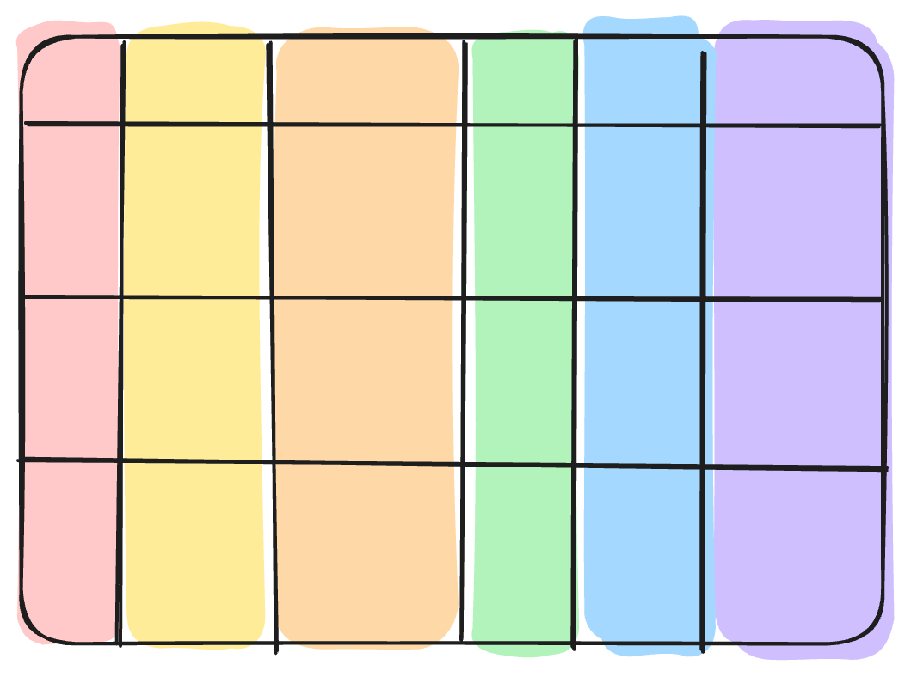

# Technical fields and aggregations are not business data

**Technical Fields** — metadata for operations, not meaning:
`created_at`, `batch_id`, `_source`, `_etl_version`, `is_deleted`

**Aggregations** — pre-computed summaries embedded in the table:
`total_revenue_ytd`, `avg_order_value_30d`

They **reduce normality** — use them deliberately.

<!-- TODO: Visual - HIGH PRIORITY
Type: Excalidraw (assets/table.excalidraw — technical grey, aggregations red)
-->

<!--
Technical fields are the columns the business doesn't care about but engineering does.
When was this row inserted? Which batch process created it? Is this a soft delete?
Critical for operations and debugging — but they carry no business meaning.
Aggregations are the pre-computed summaries — year-to-date revenue, 30-day moving averages.
They exist for performance: instead of computing them at query time, someone stored the result directly in the table.
But here's the trap: aggregations embed assumptions about query patterns.
If those patterns change, the aggregations become stale — or worse, silently wrong.
When you're dissecting an OBT, find the aggregation columns and ask: who computed these? When? Are they still valid?
-->
