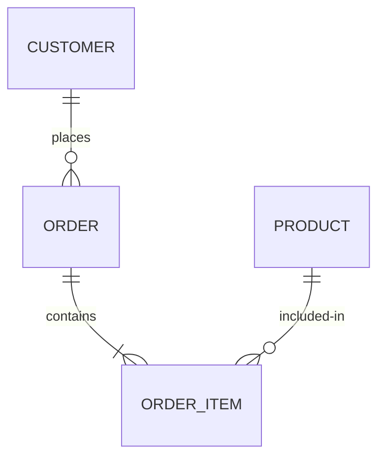

# ERDs define the ontology — the taxonomy of your data

- **PK → FK** defines directionality — who owns the relationship
- Time-series: composite key (entity ID + timestamp)

<!--
Entity-Relationship Diagrams are more than technical documentation — they're the ontology of your data.
They define what entities exist, what their attributes are, and how they relate to each other.
The PK to FK relationship defines directionality. Customer places orders. Orders contain items. Products appear in items.
That directionality is critical, because when you JOIN tables, you often lose it.
Time-series tables are a special case: they use a composite key of the entity ID plus a timestamp, because the same entity has many rows over time.
Keep this diagram in your head — you'll need it when we talk about JOINs.
-->
