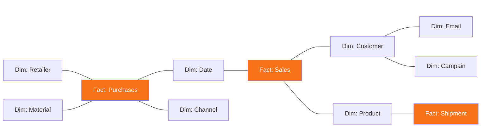

# Star schema: facts at the center, dimensions around it

**Dim tables**: describe actors — Customers, Products
**Fact tables**: describe events — Purchases, Sales

<!--
The Star schema is the most common modeling pattern for analytics — and for good reason.
It's simple, readable, and maps directly to how business questions are asked.
Dimension tables describe your actors: who your customers are, what your products look like.
Fact tables describe events: what happened, involving which actors, at what time.
When you dissect an OBT, you're often reverse-engineering a Star schema.
The dimension columns you identified map to dimension tables. The fact columns map to a fact table. The keys connect them.
Once you have the Star schema, building the OBT from it is deliberate and controlled — not chaotic denormalization.
-->
