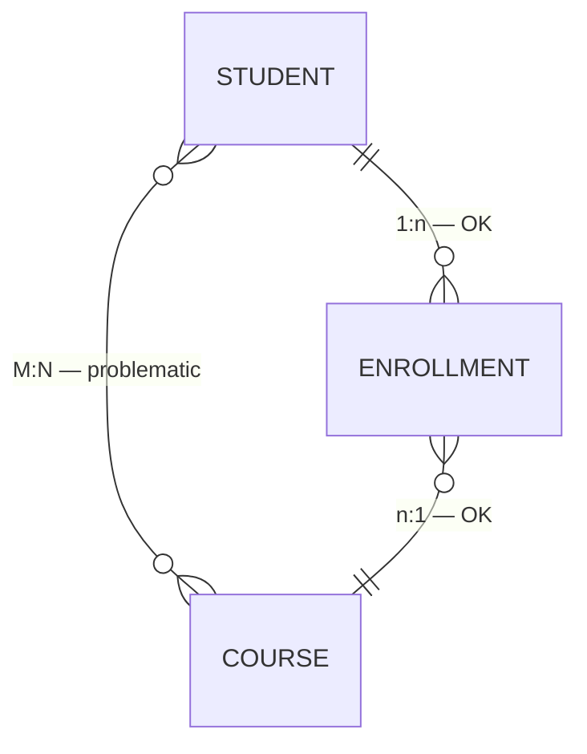

# M:N relationships need a bridge — not a direct join

Bridge contains: `student_id` (FK) + `course_id` (FK) → composite PK

<!--
Cardinality tells you how entities relate.
One customer places many orders — that's a one-to-many. Straightforward in SQL.
But many students enroll in many courses — that's many-to-many. And RDBMS systems handle M:N poorly when modeled directly.
The solution is a bridge table — sometimes called a junction table or association table.
The bridge contains the foreign keys from both sides, which together form its composite primary key.
This reduces the M:N into two clean 1:n relationships that SQL can handle without surprises.
When you encounter what looks like a many-to-many in an OBT, look for a bridge table upstream. If it's missing, you'll need to create one before you can build a clean model.
-->
