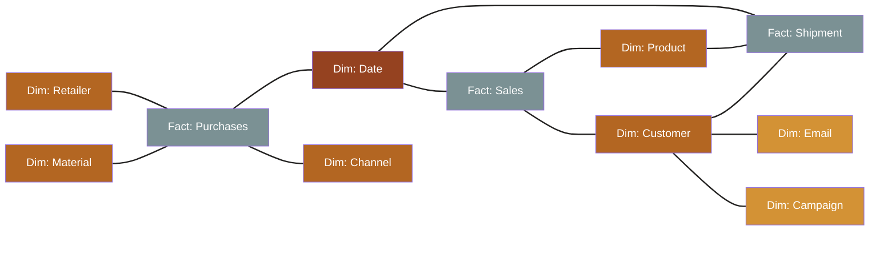

# Star schema: facts at the center, dimensions around it

### **Fact tables**: describe events, collect measures

### **Dimension tables**: describe actors

- When connected to a fact table, ought to be *stable*. If not, attach **satellite dimensions** → Snowflake

- When shared across multiple fact tables, they are called **conformed**

<!--
TIMING: 60 seconds

"I'll cover only the star schema — it's the most widespread, and it's enough for our purposes."

Point to the diagram:
"Fact tables sit at the center. They describe events and collect the measures. Dimension tables radiate outward — they describe the actors and their attributes."

"Dimensions connected to a fact table should be STABLE. The columns shouldn't change underneath you while the pipeline is running."

"If they DO change — like email addresses or marketing campaign names — consider splitting them into satellite dimensions. Park them in a separate table and point to the most recent value. That turns your star into a snowflake schema. But that's a topic for another talk."

"One more term worth knowing: when a dimension is shared across multiple fact tables, it's called a CONFORMED dimension. The date dimension in this diagram is the classic example — both Sales and Purchases share it. It may come up in questions, so: now you know the word."

LIKELY QUESTION: "What about Data Vault or Anchor Modeling?"
A: Valid alternatives, especially for auditability and schema evolution. Star schema is the simplest starting point and covers 80% of OLAP use cases. The other approaches add complexity in exchange for specific guarantees — worth researching once you're comfortable with star.

TRANSITION TO NEXT: "Now: the most skipped step."
-->

