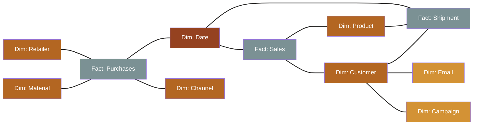

# Star schema: facts at the center, dimensions around it

### **Fact tables**: describe events, collect measures

### **Dimension tables**: describe actors

- When connected to a fact table, ought to be *stable*. If not, attach **satellite dimensions** → Snowflake

- When shared across multiple fact tables, they are called **conformed**

