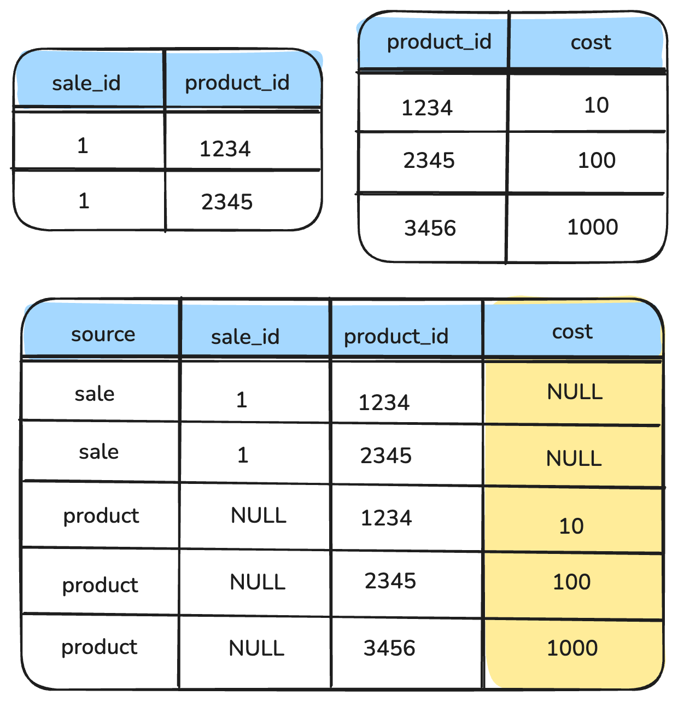

::default::

# UNION BRIDGES

Solve what JOINs cannot

::left::

JOIN → entities side-by-side (loses directionality)

UNION → stacked underneath (preserves direction)

**The pattern**:
1. Build a **bridge table** with `UNION ALL`
2. JOIN other tables to the bridge — not to each other

Solves **FAN TRAP** · **CHASM TRAP** · **LOOPS**

<!--
TIMING: 60 seconds

"This is where union bridges come in. And this is, frankly, the most underused technique in analytical data engineering."

"A join places rows side by side — it loses directionality. A union stacks rows on top of each other — it preserves direction. And it ensures no data goes missing."

Walk through the pattern:
"The recipe has two steps. First: build a bridge table using UNION ALL — every entity from every source gets its own row, tagged with its origin."
"Second: JOIN all other tables to the bridge — never to each other."

Point to the diagram:
"Here: sales and products. A sale references two products. The third product has no matching sale. A standard join DROPS that third row — silent data loss. In a union bridge, every row is present. The structure makes data loss impossible by design."

"Union bridges solve three traps: the fan trap, the chasm trap, and loops. Let's look at each."

TRANSITION TO NEXT: "Fan trap first."
-->

::right::

  

