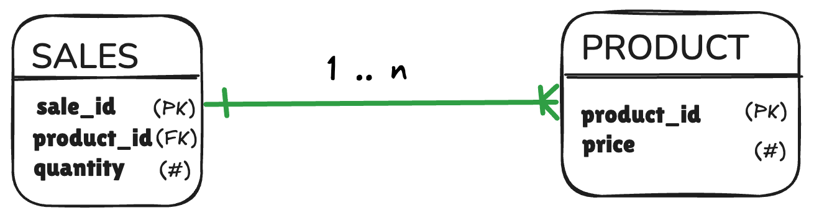

# Fan Traps explode your measures

**FAN TRAP**: facts fan out and double-count:

  

→ joining fans product data across all sales rows

→ sum double-counts

<!--
TIMING: 50 seconds

"The fan trap. Probably the most common silent bug in denormalized table pipelines."

"Whenever you have a one-to-many cardinality and measures are involved, joining can silently duplicate rows. Run a SUM or AVERAGE over those duplicates... and you get the wrong number. Every time. No error, no warning — just a wrong number that looks plausible."

"Here's the mnemonic: look at the diagram. See that crowfoot-style ending on the relationship line? It looks like a fan — the kind your grandma used to keep cool in summer. Many spokes, many duplicates."

HUMOR: "Your grandma's fan: now officially the most useful thing she has ever contributed to data engineering. Generations of wisdom, converging on one database anti-pattern."

"If you see a fan in your ERD and you're about to join on that relationship with measures involved — stop. Reach for a union bridge instead."

TRANSITION TO NEXT: "The chasm trap is nastier."
-->
