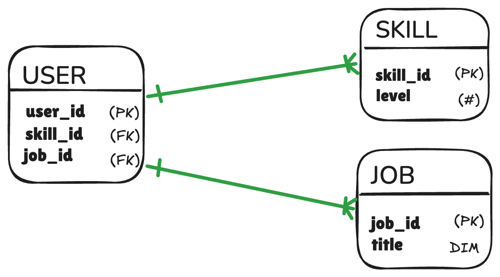

# Chasm traps explode quadratically

**CHASM TRAP**: joining multiple satellite dimensions explodes rows

  

- the wrong join generates `#(SKILLS) * #(JOBS)` rows → **Quadratic**

- with union we have `#(SKILLS) + #(JOBS)` rows → **Linear**

<!--
The Chasm Trap is subtler. You have Users in the middle, with Skills on one side and Languages on the other.
Users without skills survive the first join. Users without languages survive the second join.
But when you join all three, you risk to get a Cartesian product out of the two 
satellite tables  product out of the two satellite tables. n*m => quadratic 
explosion. If measures are contained in these dimensions, they'll likely get 
aggregated to generate the wrong numerics
-->
