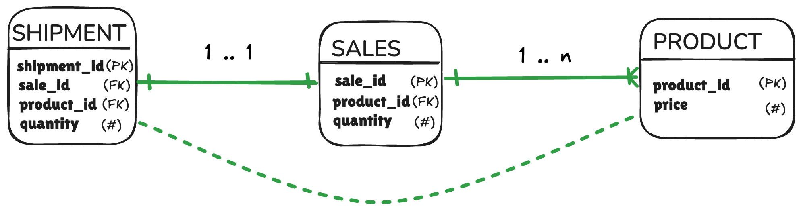

  

# Loops in JOIN chains make results unpredictable

Given **n tables**: at most **n − 1 relationships** without forming a loop.

Extra relations create **ambiguous JOIN paths**:
- SQL engines choose a path, or fails to compile a plan
- Often introduced silently when building OBTs with n+1 relations

<!--
The Loop trap is less famous than Fan and Chasm, but just as dangerous.
Here's the rule: if you have n tables in your query, you can have at most n minus one relationships between them before you create a cycle.
When a loop forms, there are multiple valid JOIN paths between your tables. The SQL engine will pick one, but it might not be the one that gives you the answer you expect.
This happens surprisingly often when building OBTs. You add one more join to enrich the data, and without realizing it, you've created a cycle.
-->

